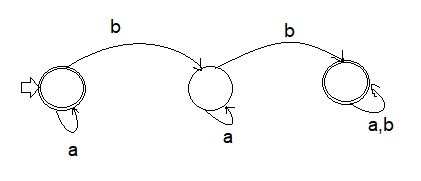

# DFA
### How to use
Example


####Update the following based on your DFA
1. _table variable contains transition table symbols with the following format
```
        String _table = "s:a:b\n"
                     +  "1:1:2\n"
                     +  "2:2:3\n"
                     +  "3:3:3\n";
```
2. _accepted states
```
        String _accepted [] = {"3","1"};
```
3. Run the Application 
